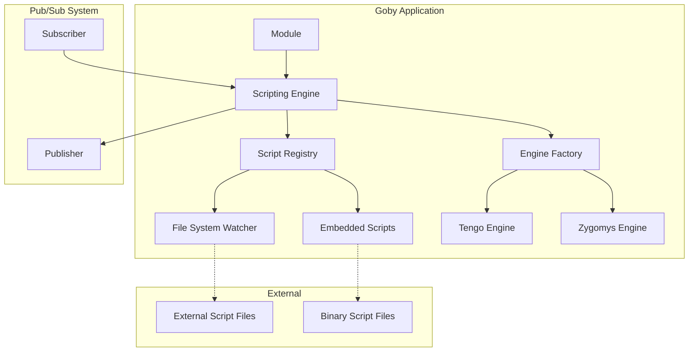

# Design Document: Embedded Scripting Engine

## Overview

The Embedded Scripting Engine provides a secure, extensible scripting capability for the Goby framework, supporting both Tengo and Zygomys languages. The system integrates seamlessly with the existing module architecture, pubsub system, and registry pattern while maintaining security boundaries and hot-loading capabilities.

## Architecture

### High-Level Components



### Integration Points

The scripting engine integrates with existing Goby systems:

1. **Module System**: Scripts are organized by module and executed within module context
2. **Pub/Sub System**: Scripts can be triggered by bus messages and publish responses
3. **Registry System**: The scripting engine is registered as a service for dependency injection
4. **HTTP Handlers**: Scripts can be executed from endpoint handlers with request context

## Components and Interfaces

### Core Interfaces

```go
// ScriptEngine provides the main interface for script execution
type ScriptEngine interface {
    // Execute runs a script with the given context and returns results
    Execute(ctx context.Context, req ExecutionRequest) (*ExecutionResult, error)

    // GetScript retrieves a script by module and name
    GetScript(moduleName, scriptName string) (*Script, error)

    // ExtractDefaultScripts writes embedded scripts to filesystem
    ExtractDefaultScripts(targetDir string) error

    // Shutdown gracefully stops the engine and cleans up resources
    Shutdown(ctx context.Context) error
}

// ScriptRegistry manages script discovery, loading, and hot-reloading
type ScriptRegistry interface {
    // LoadScripts discovers and loads all available scripts
    LoadScripts() error

    // GetScript retrieves a script by module and name
    GetScript(moduleName, scriptName string) (*Script, error)

    // ReloadScript reloads a specific script from disk
    ReloadScript(moduleName, scriptName string) error

    // ListScripts returns all available scripts organized by module
    ListScripts() map[string][]string

    // StartWatcher begins monitoring external script files for changes
    StartWatcher(ctx context.Context) error
}

// EngineFactory creates language-specific script engines
type EngineFactory interface {
    // CreateEngine returns an engine for the specified language
    CreateEngine(language ScriptLanguage) (LanguageEngine, error)

    // SupportedLanguages returns all supported script languages
    SupportedLanguages() []ScriptLanguage
}

// LanguageEngine executes scripts in a specific language
type LanguageEngine interface {
    // Compile prepares a script for execution
    Compile(script *Script) (*CompiledScript, error)

    // Execute runs a compiled script with context
    Execute(ctx context.Context, compiled *CompiledScript, input *ScriptInput) (*ScriptOutput, error)

    // SetSecurityLimits configures resource and security constraints
    SetSecurityLimits(limits SecurityLimits) error
}
```

### Data Models

```go
// Script represents a script file with metadata
type Script struct {
    ModuleName   string
    Name         string
    Language     ScriptLanguage
    Content      string
    Source       ScriptSource // Embedded or External
    LastModified time.Time
    Checksum     string
    // OriginalLanguage tracks the embedded script's language for fallback
    OriginalLanguage ScriptLanguage
}

// ExecutionRequest contains all data needed to execute a script
type ExecutionRequest struct {
    ModuleName   string
    ScriptName   string
    Input        *ScriptInput
    Timeout      time.Duration
    SecurityLimits SecurityLimits
}

// ScriptInput provides context and data to the executing script
type ScriptInput struct {
    // Context data from the calling module
    Context map[string]interface{}

    // Message data if triggered by pub/sub
    Message *pubsub.Message

    // HTTP request data if triggered by handler
    HTTPRequest *HTTPRequestData

    // Available functions exposed to the script
    Functions map[string]interface{}
}

// ScriptOutput contains the results of script execution
type ScriptOutput struct {
    Result   interface{}
    Logs     []string
    Metrics  ExecutionMetrics
    Error    error
}

// SecurityLimits defines resource constraints for script execution
type SecurityLimits struct {
    MaxExecutionTime time.Duration
    MaxMemoryBytes   int64
    AllowedPackages  []string
    ExposedFunctions map[string]interface{}
}

// ScriptLanguage represents supported scripting languages
type ScriptLanguage string

const (
    LanguageTengo   ScriptLanguage = "tengo"
    LanguageZygomys ScriptLanguage = "zygomys"
)

// ScriptSource indicates where a script was loaded from
type ScriptSource string

const (
    SourceEmbedded ScriptSource = "embedded"
    SourceExternal ScriptSource = "external"
)
```

### Module Integration

```go
// ScriptableModule extends the base Module interface for script support
type ScriptableModule interface {
    module.Module

    // GetScriptConfig returns script configuration for this module
    GetScriptConfig() *ModuleScriptConfig

    // GetExposedFunctions returns functions available to scripts
    GetExposedFunctions() map[string]interface{}
}

// ModuleScriptConfig defines script behavior for a module
type ModuleScriptConfig struct {
    // Scripts that should be executed on pub/sub messages
    MessageHandlers map[string]string // topic -> script name

    // Scripts available for HTTP endpoint execution
    EndpointScripts map[string]string // endpoint -> script name

    // Default security limits for this module's scripts
    DefaultLimits SecurityLimits

    // Whether to auto-extract embedded scripts on startup
    AutoExtract bool
}
```

## Error Handling

### Error Types

```go
// ScriptError represents script-related errors with context
type ScriptError struct {
    Type        ErrorType
    ModuleName  string
    ScriptName  string
    Message     string
    Cause       error
    Timestamp   time.Time
}

type ErrorType string

const (
    ErrorTypeCompilation     ErrorType = "compilation"
    ErrorTypeExecution      ErrorType = "execution"
    ErrorTypeTimeout        ErrorType = "timeout"
    ErrorTypeMemoryLimit    ErrorType = "memory_limit"
    ErrorTypeSecurityViolation ErrorType = "security_violation"
    ErrorTypeNotFound       ErrorType = "not_found"
    ErrorTypeInvalidSyntax  ErrorType = "invalid_syntax"
)
```

### Error Handling Strategy

1. **Compilation Errors**: Logged and fallback to embedded scripts if external script fails
2. **Runtime Errors**: Captured and returned without crashing the host module
3. **Security Violations**: Immediately terminate script execution and log security event
4. **Resource Limits**: Gracefully terminate script and return timeout/memory error
5. **File System Errors**: Log and continue with cached/embedded scripts

### Cross-Language Script Replacement

The system explicitly supports replacing scripts with different languages than the embedded default:

1. **Language Detection**: Script language is determined by file extension (`.tengo`, `.zygomys`)
2. **Engine Selection**: The appropriate language engine is selected based on the external script's language
3. **Fallback Compatibility**: If an external script in a different language fails, the system falls back to the embedded script in its original language
4. **Example**: An embedded `damage_calculator.tengo` script can be replaced by an external `damage_calculator.zygomys` script

This allows domain experts to choose their preferred scripting language regardless of what the module developer originally embedded.

## Security Model

### Sandboxing Strategy

1. **Package Whitelisting**: Only explicitly allowed Go packages are accessible
2. **Function Exposure**: Modules define which functions scripts can call
3. **Resource Limits**: CPU time and memory constraints prevent DoS attacks
4. **File System Isolation**: Scripts cannot access arbitrary file system paths
5. **Network Restrictions**: No direct network access unless explicitly provided

### Default Security Configuration

```go
var DefaultSecurityLimits = SecurityLimits{
    MaxExecutionTime: 5 * time.Second,
    MaxMemoryBytes:   10 * 1024 * 1024, // 10MB
    AllowedPackages: []string{
        "fmt",
        "strings",
        "strconv",
        "time",
        "math",
    },
    ExposedFunctions: map[string]interface{}{
        "log":     logFunction,
        "publish": publishFunction,
    },
}
```

## File Organization

### Directory Structure

```
goby_binary
├── scripts/                    # External script directory
│   ├── wargame/               # Module-specific scripts (implementation focus)
│   │   ├── damage_calculator.tengo
│   │   ├── event_processor.zygomys
│   │   └── hit_simulator.tengo
│   └── shared/                # Shared utility scripts
│       ├── utils.tengo
│       └── helpers.zygomys
└── internal/
    ├── script/                # Core scripting engine (framework level)
    │   ├── engine.go
    │   ├── registry.go
    │   ├── factory.go
    │   └── engines/
    │       ├── tengo.go
    │       └── zygomys.go
    └── modules/
        └── wargame/           # Only modify wargame module
            └── scripts/       # Embedded scripts
                ├── embed.go   # Go embed directives
                ├── damage_calculator.tengo
                ├── event_processor.zygomys
                └── hit_simulator.tengo
```

### Embedded Script Integration

```go
// Example: internal/modules/wargame/scripts/embed.go
package scripts

import _ "embed"

//go:embed damage_calculator.tengo
var DamageCalculatorScript string

//go:embed event_processor.zygomys
var EventProcessorScript string

//go:embed hit_simulator.tengo
var HitSimulatorScript string

// GetEmbeddedScripts returns all embedded scripts for the wargame module
func GetEmbeddedScripts() map[string]string {
    return map[string]string{
        "damage_calculator": DamageCalculatorScript,
        "event_processor":   EventProcessorScript,
        "hit_simulator":     HitSimulatorScript,
    }
}
```

## Testing Strategy

### Unit Testing

1. **Engine Factory Tests**: Verify correct engine creation for each language
2. **Script Registry Tests**: Test script loading, caching, and hot-reloading
3. **Security Tests**: Validate resource limits and sandboxing
4. **Error Handling Tests**: Ensure graceful failure modes

### Integration Testing

1. **Module Integration**: Test script execution within real modules
2. **Pub/Sub Integration**: Verify message-triggered script execution
3. **File System Tests**: Test external script loading and hot-reloading
4. **Performance Tests**: Validate resource limit enforcement

### Security Testing

1. **Sandbox Escape Tests**: Attempt to access restricted resources
2. **DoS Protection Tests**: Verify timeout and memory limit enforcement
3. **Malicious Script Tests**: Test handling of intentionally harmful scripts

## Configuration

### Environment Variables

The scripting engine supports several configuration options:

```bash
# Hot-reload configuration
HOT_RELOAD_SCRIPTS=true|false  # Enable/disable file system watching (default: true)

# Security configuration
SCRIPT_MAX_EXECUTION_TIME=5s   # Maximum script execution time
SCRIPT_MAX_MEMORY_BYTES=10MB   # Maximum memory per script execution
```

### Hot-Reload Behavior

- **HOT_RELOAD_SCRIPTS=true** (default): File system watcher monitors external scripts for changes and automatically reloads them
- **HOT_RELOAD_SCRIPTS=false**: Scripts are loaded once at startup; changes require server restart

This is particularly useful for production environments where you want stable script behavior without the overhead of file system monitoring.

## Implemented Features

### ✅ Completed Implementation

1. **Core Tengo Engine**: Full Tengo language support with security limits
2. **External Script Loading**: Automatic loading from `scripts/` directory
3. **Hot-Reloading**: File system watcher with automatic script updates
4. **Script Extraction**: CLI command to extract embedded scripts (`--extract-scripts`)
5. **Logging Integration**: Scripts can use `log()` function that integrates with Goby's structured logging
6. **Module Integration**: Complete integration with wargame module
7. **Error Handling**: Comprehensive error reporting and recovery
8. **Script Priority**: External scripts override embedded scripts
9. **Security Limits**: Execution timeouts and memory constraints

### 🔄 Deferred Features

1. **Zygomys Engine**: Deferred to focus on production-ready Tengo implementation
2. **Advanced Metrics**: Basic metrics implemented, advanced monitoring deferred
3. **Management UI**: Command-line tools implemented, web UI deferred

## Performance Considerations

### Optimization Strategies

1. **Script Compilation Caching**: Compiled scripts are cached until source changes
2. **Lazy Loading**: Scripts are loaded on first use, not at startup
3. **Connection Pooling**: Reuse language engine instances when possible
4. **Async Execution**: Non-blocking script execution for pub/sub handlers
5. **Priority Loading**: External scripts take priority over embedded ones

### Monitoring and Metrics

```go
type ExecutionMetrics struct {
    CompilationTime time.Duration
    ExecutionTime   time.Duration
    MemoryUsed      int64
    Success         bool
    ErrorType       ErrorType
}
```

### Script Development

Scripts have access to:

- `log(message)`: Structured logging that appears in Goby logs
- `rand.float()`: Random number generation via Tengo's rand module
- Standard Tengo built-ins: string manipulation, math operations, etc.
- Module-specific functions exposed by the host module

**Note**: `print()` function is not available in server-side scripts (goes to stdout). Use `log()` for debugging and monitoring.

## Implementation Phases

### Phase 1: Core Infrastructure

- Implement basic interfaces and data models
- Create engine factory with Tengo support
- Build script registry with embedded script loading
- Add basic security limits

### Phase 2: Module Integration

- Integrate with existing module system
- Add pub/sub message handling
- Implement HTTP handler integration
- Create script extraction command

### Phase 3: Advanced Features

- Add Zygomys language support
- Implement hot-reloading with file system watching
- Add comprehensive error handling and logging
- Create management and monitoring interfaces

### Phase 4: Production Readiness

- Performance optimization and caching
- Comprehensive security testing
- Documentation and examples
- Production deployment tools
