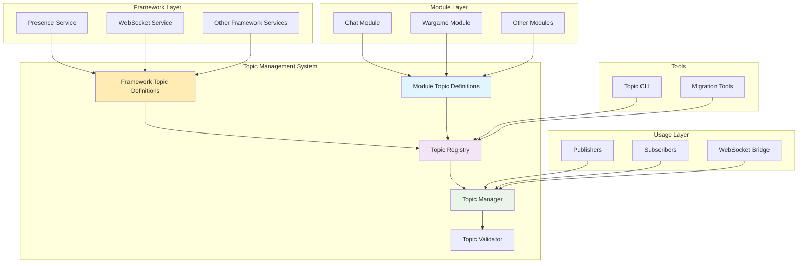

# Topic Management System Design

## Overview

The new Topic Management System replaces the current TopicRegistry with a compile-time safe, strongly-typed approach that eliminates magic strings and provides centralized topic management. The system uses Go's type system to enforce topic safety at compile time while maintaining backward compatibility during migration.

The design leverages Go's package-level constants and type definitions to create a system where topics are defined once per module and used consistently throughout the application. This approach ensures that typos and undefined topics are caught during compilation rather than runtime.

## Architecture

### Core Components



### Type-Safe Topic System

The system uses a combination of Go interfaces, structs, and package-level constants to provide compile-time safety:

1. **Topic Interface**: Defines the contract for all topics
2. **Typed Topic Structs**: Concrete implementations with compile-time guarantees
3. **Framework Topic Packages**: Core framework services (like presence, websocket) define their topics
4. **Module Topic Packages**: Each module defines its own topics in isolation (JAR/WAR paradigm)
5. **Central Registry**: Maintains runtime metadata and discovery capabilities with proper scoping

## Components and Interfaces

### Topic Definition Interface

```go
// Topic represents a strongly-typed topic identifier
type Topic interface {
    // Name returns the unique string identifier for this topic
    Name() string

    // Module returns the module that owns this topic
    Module() string

    // Description returns human-readable documentation
    Description() string

    // Pattern returns the routing pattern (for wildcards)
    Pattern() string

    // Example returns a usage example
    Example() string

    // Metadata returns additional topic information
    Metadata() map[string]interface{}
}
```

### Typed Topic Implementation

```go
// TypedTopic provides compile-time safety for topic usage
type TypedTopic struct {
    name        string
    module      string
    description string
    pattern     string
    example     string
    metadata    map[string]interface{}
}

// Compile-time interface compliance check
var _ Topic = (*TypedTopic)(nil)
```

### Topic Definition Patterns

#### Framework Topics

Framework services define their topics in their respective packages:

```go
// internal/presence/topics.go
package presence

import "github.com/nfrund/goby/internal/topicmgr"

var (
    // UserOnline represents a user coming online
    UserOnline = topicmgr.DefineFramework(topicmgr.TopicConfig{
        Name:        "presence.user.online",
        Scope:       "framework",
        Description: "Published when a user comes online",
        Pattern:     "presence.user.online",
        Example:     `{"userID":"user123","timestamp":"2024-01-01T00:00:00Z"}`,
    })

    // UserOffline represents a user going offline
    UserOffline = topicmgr.DefineFramework(topicmgr.TopicConfig{
        Name:        "presence.user.offline",
        Scope:       "framework",
        Description: "Published when a user goes offline",
        Pattern:     "presence.user.offline",
        Example:     `{"userID":"user123","timestamp":"2024-01-01T00:00:00Z"}`,
    })
)
```

#### Module Topics

Each module defines its topics in a dedicated `topics` subpackage (JAR/WAR paradigm):

```go
// internal/modules/chat/topics/topics.go
package topics

import "github.com/nfrund/goby/internal/topicmgr"

var (
    // NewMessage represents a new chat message from a client
    NewMessage = topicmgr.DefineModule(topicmgr.TopicConfig{
        Name:        "client.chat.message.new",
        Module:      "chat",
        Scope:       "module",
        Description: "A new chat message sent by a client",
        Pattern:     "client.chat.message.new",
        Example:     `{"action":"client.chat.message.new","payload":{"content":"Hello!"}}`,
    })

    // Messages represents broadcast messages to all clients
    Messages = topicmgr.DefineModule(topicmgr.TopicConfig{
        Name:        "chat.messages",
        Module:      "chat",
        Scope:       "module",
        Description: "Broadcasts a rendered chat message to all clients",
        Pattern:     "chat.messages",
        Example:     "chat.messages",
    })

    // DirectMessage represents direct messages to specific users
    DirectMessage = topicmgr.DefineModule(topicmgr.TopicConfig{
        Name:        "chat.direct",
        Module:      "chat",
        Scope:       "module",
        Description: "Sends a rendered direct message to a specific user",
        Pattern:     "chat.direct.{userID}",
        Example:     "chat.direct.user123",
    })
)
```

### Topic Manager

The Topic Manager provides the central API for topic operations with framework/module scoping:

```go
// Manager provides the main API for topic management
type Manager struct {
    registry *Registry
    validator *Validator
    mu       sync.RWMutex
}

// DefineFramework creates a new typed topic for framework services
func DefineFramework(config TopicConfig) Topic

// DefineModule creates a new typed topic for modules
func DefineModule(config TopicConfig) Topic

// Register adds a topic to the central registry
func (m *Manager) Register(topic Topic) error

// Get retrieves a topic by name (for backward compatibility)
func (m *Manager) Get(name string) (Topic, bool)

// List returns all registered topics
func (m *Manager) List() []Topic

// ListByModule returns topics for a specific module
func (m *Manager) ListByModule(module string) []Topic

// ListByScope returns topics for a specific scope (framework or module)
func (m *Manager) ListByScope(scope TopicScope) []Topic

// ListFrameworkTopics returns all framework-level topics
func (m *Manager) ListFrameworkTopics() []Topic

// Validate checks if a topic usage is valid
func (m *Manager) Validate(topic Topic, context string) error
```

### Publisher/Subscriber Integration

The system integrates seamlessly with existing pub/sub infrastructure:

```go
// Enhanced Publisher interface
type Publisher interface {
    // Publish using typed topic
    PublishToTopic(ctx context.Context, topic Topic, payload []byte, metadata map[string]string) error

    // Backward compatibility method
    Publish(ctx context.Context, msg Message) error
}

// Enhanced Subscriber interface
type Subscriber interface {
    // Subscribe using typed topic
    SubscribeToTopic(ctx context.Context, topic Topic, handler Handler) error

    // Backward compatibility method
    Subscribe(ctx context.Context, topicName string, handler Handler) error
}
```

## Data Models

### TopicConfig

```go
type TopicConfig struct {
    Name        string                 `json:"name"`        // Unique identifier
    Module      string                 `json:"module"`      // Owning module (empty for framework topics)
    Scope       TopicScope             `json:"scope"`       // Framework or module scope
    Description string                 `json:"description"` // Human-readable description
    Pattern     string                 `json:"pattern"`     // Routing pattern
    Example     string                 `json:"example"`     // Usage example
    Metadata    map[string]interface{} `json:"metadata"`    // Additional data
}

type TopicScope string

const (
    ScopeFramework TopicScope = "framework" // Core framework topics (presence, websocket, etc.)
    ScopeModule    TopicScope = "module"    // Module-specific topics (chat, wargame, etc.)
)
```

### Registry Entry

```go
type RegistryEntry struct {
    Topic       Topic     `json:"topic"`
    RegisteredAt time.Time `json:"registered_at"`
    Module      string    `json:"module"`
    UsageCount  int64     `json:"usage_count"`
}
```

### Migration State

```go
type MigrationState struct {
    LegacyTopics   []string          `json:"legacy_topics"`
    MigratedTopics map[string]string `json:"migrated_topics"`
    Status         MigrationStatus   `json:"status"`
}

type MigrationStatus string

const (
    MigrationPending    MigrationStatus = "pending"
    MigrationInProgress MigrationStatus = "in_progress"
    MigrationComplete   MigrationStatus = "complete"
)
```

## Error Handling

### Compile-Time Errors

The system leverages Go's type system to catch errors at compile time:

1. **Undefined Topics**: Using an undefined topic variable results in compilation error
2. **Type Mismatches**: Passing wrong types to topic functions fails compilation
3. **Import Errors**: Missing topic package imports are caught by the compiler

### Runtime Errors

For runtime scenarios, the system provides structured error handling:

```go
type TopicError struct {
    Type    ErrorType `json:"type"`
    Topic   string    `json:"topic"`
    Module  string    `json:"module"`
    Message string    `json:"message"`
    Cause   error     `json:"cause,omitempty"`
}

type ErrorType string

const (
    ErrorTopicNotFound      ErrorType = "topic_not_found"
    ErrorDuplicateRegistration ErrorType = "duplicate_registration"
    ErrorInvalidPattern     ErrorType = "invalid_pattern"
    ErrorValidationFailed   ErrorType = "validation_failed"
)
```

### Error Recovery

The system includes graceful degradation for migration scenarios:

1. **Legacy Topic Fallback**: Unknown topics fall back to string-based lookup
2. **Validation Warnings**: Non-fatal validation issues are logged as warnings
3. **Partial Migration Support**: Mixed usage of old and new systems is supported

## Testing Strategy

### Unit Testing

1. **Topic Definition Tests**: Verify topic creation and metadata
2. **Registry Tests**: Test registration, lookup, and validation
3. **Manager Tests**: Verify core functionality and error handling
4. **Integration Tests**: Test pub/sub integration

### Compile-Time Testing

1. **Type Safety Tests**: Verify compile-time error generation
2. **Interface Compliance**: Ensure all implementations satisfy interfaces
3. **Import Tests**: Verify package structure and dependencies

### Migration Testing

1. **Backward Compatibility**: Ensure existing code continues to work
2. **Gradual Migration**: Test mixed old/new usage scenarios
3. **Data Migration**: Verify topic registry data migration

### Performance Testing

1. **Lookup Performance**: Benchmark topic resolution speed
2. **Memory Usage**: Monitor registry memory consumption
3. **Concurrent Access**: Test thread safety under load

## Migration Strategy

### Phase 1: Foundation (Backward Compatible)

1. Implement new topic management system alongside existing registry
2. Maintain full backward compatibility with current TopicRegistry
3. Add new typed topic definitions in parallel to existing topics
4. Update CLI tools to support both systems

### Phase 2: Module Migration (Gradual)

1. Migrate modules one at a time to new topic system
2. Update publishers and subscribers to use typed topics
3. Maintain dual support during transition period
4. Add validation warnings for magic string usage

### Phase 3: Cleanup (Breaking Changes)

1. Remove legacy TopicRegistry code
2. Eliminate magic string support
3. Enforce compile-time topic safety
4. Update documentation and examples

### Migration Tools

```go
// Migration utilities
type Migrator struct {
    oldRegistry *topics.TopicRegistry
    newManager  *Manager
}

// AnalyzeLegacyUsage scans codebase for magic strings
func (m *Migrator) AnalyzeLegacyUsage() ([]LegacyUsage, error)

// GenerateTopicDefinitions creates typed definitions from legacy topics
func (m *Migrator) GenerateTopicDefinitions() ([]TopicDefinition, error)

// ValidateMigration ensures migration completeness
func (m *Migrator) ValidateMigration() error
```

## Security Considerations

### Topic Access Control

1. **Module Isolation**: Topics are scoped to their owning modules
2. **Validation Rules**: Enforce naming conventions and patterns
3. **Registry Protection**: Prevent unauthorized topic registration

### Runtime Safety

1. **Input Validation**: Validate all topic-related inputs
2. **Error Sanitization**: Prevent information leakage in error messages
3. **Audit Logging**: Log topic registration and usage events

## Performance Considerations

### Lookup Optimization

1. **Hash-based Registry**: O(1) topic lookup by name
2. **Module Indexing**: Fast filtering by module
3. **Caching**: Cache frequently accessed topics

### Memory Management

1. **Lazy Loading**: Load topic metadata on demand
2. **Weak References**: Prevent memory leaks in long-running processes
3. **Garbage Collection**: Clean up unused topic references

### Concurrency

1. **Read-Write Locks**: Optimize for read-heavy workloads
2. **Lock-Free Lookups**: Use atomic operations where possible
3. **Parallel Registration**: Support concurrent module initialization
