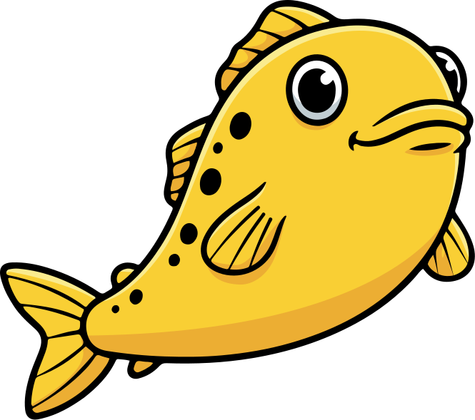

# Goby

<p align="center">
  
</p>

Goby is a project template for building web applications with Go, SurrealDB, and Tailwind CSS, featuring live-reloading for a great developer experience.

## Development Setup

### Prerequisites

Before you begin, ensure you have the following tools installed:

- **Go** (1.22 or newer) - [Download](https://golang.org/dl/)
- **Node.js and npm** (LTS version recommended) - [Download](https://nodejs.org/)
- **Overmind** - Process manager for development
  ```sh
  # Install with Go (recommended)
  go install github.com/DarthSim/overmind/v2@latest

  # Alternative installations:
  # macOS (Homebrew): brew install overmind
  # Arch Linux: pacman -S overmind
  ```
- **tmux** - Terminal multiplexer used by Overmind
  ```sh
  # macOS (Homebrew)
  brew install tmux
  
  # Linux (Debian/Ubuntu)
  # sudo apt-get install tmux
  ```
- **Air** - For live-reloading Go applications
  ```sh
  go install github.com/air-verse/air@latest
  ```
  Make sure your `$GOPATH/bin` is in your `$PATH`.

### Quick Start

1. **Install Node.js dependencies**
   ```sh
   npm install
   ```
   This will install all required frontend dependencies including Tailwind CSS and other JavaScript packages.

2. **Start development server**
   ```sh
   make dev
   ```
   This single command starts:
   - Go application with hot-reloading (via `air`)
   - Templ file watcher
   - Tailwind CSS compiler
   - Other development services

3. **Explore the application**
   Open http://localhost:8080 in your browser and log in. Navigate to the **Chat** page to see the real-time features:
   - Click "Trigger Hit Event" in the Game State Monitor
   - Watch HTML fragments update in the chat log via WebSocket
   - See raw JSON data update in the monitor

### Alternative: Manual Process Management

If you prefer not to use Overmind, you can run processes separately:

1. **Terminal 1: Start Tailwind watcher**
   ```sh
   npm run dev:tailwind
   ```

2. **Terminal 2: Start Go application**
   ```sh
   air
   ```

3. **Terminal 3: Watch for template changes**
   ```sh
   templ generate --watch
   ```

This achieves the same result as `make dev` but requires managing each process separately.

## Module System

Goby features a modular architecture where features are organized into self-contained packages under `internal/modules/`. Each module implements the `module.Module` interface, allowing it to be registered and booted by the core application. This promotes strong separation of concerns and makes the application highly extensible.

### The Module Interface

The `module.Module` interface defines the contract for how a module interacts with the application kernel.

```go
type Module interface {
	Name() string
	Register(s *server.Server) error
	Boot(g *echo.Group, s *server.Server) error
}
```

**Method Lifecycle:**

1.  **`Name()`**: Returns a unique, lowercase name for the module (e.g., `"greeter"`). This is used for namespacing routes.
2.  **`Register()`**: Called during application startup. This is the ideal place for dependency injection and service registration. The `*server.Server` instance acts as a service locator, providing access to shared services like the database (`s.DB`), configuration (`s.Cfg`), and pub/sub bus (`s.PubSub`).
3.  **`Boot()`**: The final stage of startup. This method is for registering the module's HTTP routes within a prefixed `echo.Group` and for starting any background processes (like pub/sub subscribers).

### Creating a New Module

Follow these steps to create a new module:

1.  **Create the Directory Structure**
    Create a new directory for your module under `internal/modules/`. For a module named `greeter`, the structure would be:

    ```
    internal/modules/
    └── greeter/
        ├── module.go          # The module's main entrypoint (implements module.Module)
        ├── handler.go         # HTTP handlers for the module's routes
        └── service.go         # Core business logic and types
        # Since templates are compiled Go code with `templ`,
        # they are typically co-located with handlers or in a `view` package.
    ```

2.  **Implement the `Module` Interface**
    In `greeter/module.go`, create a struct (e.g., `GreeterModule`) and implement the interface methods. This example shows a complete, working implementation.

    ```go
    // internal/modules/greeter/module.go
    package greeter

    import (
    	"github.com/labstack/echo/v4"
    	"github.com/nfrund/goby/internal/server"
    )

    // GreeterModule is the entrypoint for the greeter feature.
    type GreeterModule struct {
    	handler *Handler // The module's HTTP handler
    }

    func (m *GreeterModule) Name() string { return "greeter" }

    func (m *GreeterModule) Register(s *server.Server) error {
    	// Create the module's service and handler, injecting shared dependencies from the server.
    	service := NewService(s.PubSub)
    	m.handler = NewHandler(service)
    	return nil
    }

    func (m *GreeterModule) Boot(g *echo.Group, s *server.Server) error {
    	// Register the module's routes under the group provided by the kernel.
    	// e.g., GET /greeter/hello
    	g.GET("/hello", m.handler.SayHello)
    	return nil
    }
    ```

3.  **Activate the Module**
    Finally, add your new module to the `AppModules` slice in `internal/server/kernel.go`. This is the single place to enable or disable modules for the entire application.
    ```go
    // internal/server/kernel.go
    var AppModules = []module.Module{
        &wargame.WargameModule{},
        &greeter.GreeterModule{}, // Add your new module here
    }
    ```

## Real-time Architecture

Goby uses a message bus (Watermill) connected to clients via WebSockets to enable real-time updates. This architecture allows for efficient communication between the server and clients.

### Message Flow (Broadcast)

1. **Backend Event**: An event occurs in the backend (e.g., a new chat message is posted).
2. **HTML Rendering**: The module renders an HTML fragment using Templ components.
3. **Message Publishing**: The module publishes the fragment to a Watermill topic (e.g., `html-broadcast`).
4. **WebSocket Delivery**: The WebSocket bridge receives the message and forwards it to all connected clients on the `/app/ws/html` endpoint.
5. **Client Update**: htmx on the client-side swaps the content into the appropriate part of the page.

### Direct Messaging

For user-specific updates:
1. Messages are published to user-specific topics (e.g., `html-direct-user:user123`).
2. The WebSocket bridge routes these messages only to the specified user's active connections.

### Example: Game State Updates

Here's how the wargame module handles real-time updates:

```go
// Publish a game state update
payload := map[string]interface{}{
    "type": "game_update",
    "data": gameState,
}

// Publish to all connected clients
h.publisher.Publish("html-broadcast", message.NewMessage(
    uuid.New().String(),
    payload,
))
```

## Real-time Architecture: The Watermill Bridge

A core feature of this template is its real-time architecture, designed for modularity and scalability. It's built around a **Watermill** message bus, which is connected to clients via a **WebSocket Bridge**. This allows backend modules to communicate with each other and with the frontend in a decoupled manner.

This "presentation-centric" approach allows various backend services (e.g., a chat module, a game engine) to operate independently. They can focus on their own logic, render their state into a self-contained HTML component, and then publish it to a Watermill topic for delivery to clients.

### The Broadcast Flow

The data and presentation flow follows these steps:

1.  **Event Occurs:** An event is triggered somewhere in the backend. This could be a user sending a chat message or a game engine calculating a state change.
2.  **Render Fragment:** The responsible module uses the application's template renderer to create a self-contained HTML fragment representing the new state (e.g., a `<div>` for a new chat message). This fragment often includes `hx-swap-oob` attributes to tell htmx where to place it on the client-side.
3.  **Publish to Topic:** The module publishes a message containing the rendered HTML to a broadcast topic (e.g., `html-broadcast` or `data-broadcast`).
4.  **Bridge Subscribes & Forwards:** The WebSocket Bridge, which subscribes to these topics, receives the message.
5.  **Bridge Delivers to Client:** The bridge forwards the message payload to the appropriate WebSocket endpoint (`/app/ws/html` or `/app/ws/data`), delivering it to all connected clients.
6.  **Client Receives & Swaps:** The client's browser receives the HTML fragment over the WebSocket connection. htmx processes the fragment, sees the `hx-swap-oob` attribute, and swaps the content into the correct place in the DOM.

### Example: Wargame Engine

Imagine a tabletop game engine running on the server. When one unit damages another, the engine can publish this event to all observers.
This code snippet from the `wargame` module demonstrates the process:

```go
// internal/modules/wargame/service.go

 func (s *Service) handleHit(target string, damage int) error {
 	// 1. Create an instance of the compiled `templ` component.
 	component := view.WargameDamage(target, damage)

 	// 2. Render the component to an HTML string.
 	html, err := view.RenderComponent(component)
 	if err != nil {
 		return err
 	}

 	// 3. Create a new Watermill message with the rendered HTML.
 	msg := message.NewMessage(watermill.NewUUID(), []byte(html))

 	// 4. Publish the message to the global broadcast topic.
 	return s.pubsub.Publish(topics.HTMLBroadcast, msg)
 }
```

The corresponding `templ` component (`wargame_damage.templ`) defines the structure and uses an `hx-swap-oob` attribute to tell htmx where to place the content:

```templ
templ WargameDamage(target string, damage int) {
	<div hx-swap-oob="beforeend:#game-log">
		<div class="p-2 text-red-500">{ target } takes { fmt.Sprintf("%d", damage) } damage!</div>
	</div>
}
```

This architecture decouples the game engine from the complexities of WebSocket and client management, allowing for clean, modular, and scalable real-time features.

### The Direct Message Flow

In addition to broadcasting, the system supports sending direct messages to a specific user, even if they have multiple connections (e.g., on a desktop and a phone). This is achieved by publishing a message to a user-specific topic, like `html-direct-user:some_user_id`.

The flow is nearly identical to the broadcast flow, with one key difference:

1.  **Publish to User Topic:** Instead of publishing to a generic topic like `html-broadcast`, the service publishes the message to a topic that includes the user's unique ID. For example: `topics.HTMLDirectToUser(userID)`.
2.  **Bridge Routes Message:** The WebSocket Bridge, which manages user sessions, identifies the active connections for that specific user and sends the payload only to them.

This project includes a live, interactive demonstration of this feature. Once logged in, navigate to the **Chat** page. You will find a "Game State Monitor" with a button to trigger a random wargame event. Clicking it will publish an HTML fragment to the chat log and a JSON data object to the monitor, showcasing both real-time channels in action.

## UI Components & Asset Management

Goby uses modern web development tools for building and managing UI components and static assets, providing a fast development experience with hot-reloading and optimized production builds.

### UI Components

Goby leverages two powerful templating systems:

- **[Templ](https://templ.guide/)**: A type-safe HTML templating language for Go that compiles to Go code, providing excellent performance and IDE support.
- **[Gomponents](https://www.gomponents.com/)**: A view library for writing HTML in Go, offering a clean, type-safe way to build UI components.

**Template Organization**

Goby's UI components are organized in the following structure:

- **`web/src/templates/`** - Main templates directory
  - `components/` - Reusable UI components
  - `layouts/` - Base layouts and page templates
  - `pages/` - Page-specific templates
  - `partials/` - Reusable template partials

- **Module Templates** - Feature-specific templates are located in their respective module directories:
  - `internal/modules/<module-name>/templates/`

### Development Workflow

Goby uses [Overmind](https://github.com/DarthSim/overmind) to manage multiple processes during development, making it easy to run and monitor all required services with a single command.

#### Prerequisites

1. **Install Overmind**:
   - **Using Go** (recommended if you have Go installed):
     ```sh
     go install github.com/DarthSim/overmind/v2@latest
     ```
     Make sure your `$GOPATH/bin` is in your `$PATH`.
   - **macOS** (using Homebrew):
     ```sh
     brew install overmind
     ```
   - **Linux** (using Homebrew):
     ```sh
     brew install overmind
     ```
   - **Arch Linux**:
     ```sh
     pacman -S overmind
     ```
   - Other platforms: See [Overmind's installation guide](https://github.com/DarthSim/overmind#installation) for more options.

2. **Install Node.js and npm**: Required for frontend development
   - [Download and install Node.js](https://nodejs.org/) (LTS version recommended)

3. **Install Go 1.21 or later**: Required for backend development
   - [Download and install Go](https://golang.org/dl/)

#### Starting Development

1. **Using Overmind (Recommended)**:
   ```sh
   make dev
   ```
   This starts all required processes defined in the `Procfile`:
   - Go application with hot-reloading (via `air`)
   - Templ file watcher
   - Tailwind CSS compiler
   - Any other development services

2. **Alternative: Manual Process Management**
   If you prefer not to use Overmind, you can run processes separately:
   ```sh
   # Terminal 1: Start the Go application with air
   air
   
   # Terminal 2: Watch for template changes
   templ generate --watch
   
   # Terminal 3: Start the Tailwind CSS compiler
   npm run dev:tailwind
   ```

#### Component Development

1. **Templ Components**:
   - Create `.templ` files for your components
   - Changes are automatically picked up by the `templ generate --watch` process
   - Import and use components in your Go code

2. **Gomponents**:
   - Create Go files that use the `g` package to build UI components
   - Components are just Go functions that return `g.Node`
   - Use them directly in your handlers or other components

3. **Hot Reloading**:
   The development server automatically handles changes to:
   - Go files (via `air`)
   - Templ files (via `templ generate --watch`)
   - CSS/JS (via Tailwind's JIT compiler)

### Static Assets

Static assets (CSS, JS, images) are managed in the `web/` directory:

- `web/static/`: Static files served directly (images, fonts, etc.)
- `web/src/`: Source files that need processing (Sass, TypeScript, etc.)
- `web/dist/`: Compiled assets (managed by build tools)

### Production Builds

For production, run:

```sh
make build
```

This will:
1. Compile all Templ components to Go
2. Build and minify CSS/JS assets
3. Create a self-contained binary with all assets embedded

The production build uses Go's `embed` package to include all necessary assets directly in the binary, making deployment as simple as copying a single file.

## Production Deployment

This project can produce a self-contained binary that embeds all templates and static assets.

### Build Steps

The `make build-embed` command is the recommended way to create a fully self-contained production binary. It builds the minified CSS and compiles the Go application with templates and static assets embedded.

```sh
# Build minified CSS and the binary (with embedded assets)
make build-embed
```

## Production Deployment

### Building for Production

To create a production-ready binary with embedded assets:

```sh
make build
```

This will produce a single, self-contained binary in `./tmp/goby` that includes all necessary assets.

### Deployment Steps

1. **Build the binary** on your build server or local machine:
   ```sh
   make build
   ```

2. **Transfer the binary** to your production server:
   ```sh
   scp ./tmp/goby user@production-server:/opt/goby/
   ```

3. **Set up the runtime environment** with the required configuration (see Configuration section below).

### Systemd Service

Here's an example systemd service file for running Goby in production:

```ini
[Unit]
Description=Goby Web Application
After=network.target

[Service]
Type=simple
User=www-data
Group=www-data
WorkingDirectory=/opt/goby
ExecStart=/opt/goby/goby
Restart=always
EnvironmentFile=/etc/goby/env

[Install]
WantedBy=multi-user.target
```

Save this to `/etc/systemd/system/goby.service` and create the environment file at `/etc/goby/env` with your production configuration.

### Environment Variables

Set the required environment variables in production (via your process manager or a systemd unit file). See the Configuration section below for all available options.

## Configuration

The application is configured using environment variables. For local development, you can create a `.env` file in the project root to manage these settings.

### Configuration Reference

| Variable             | Description                                                                           | Default                 | Required       |
| :------------------- | :------------------------------------------------------------------------------------ | :---------------------- | :------------- |
| **`SERVER_ADDR`**    | The address and port for the server to listen on.                                     | `:8080`                 | No             |
| **`APP_BASE_URL`**   | The public base URL for the application, used for generating links in emails.         | `http://localhost:8080` | No             |
| **`SESSION_SECRET`** | A long, random string used to secure user sessions.                                   | (none)                  | **Yes (Prod)** |
| **`APP_STATIC`**     | Controls static asset serving. `disk` for development, `embed` for production builds. | `disk`                  | No             |

#### Database

| Variable           | Description                                     | Default                   | Required |
| :----------------- | :---------------------------------------------- | :------------------------ | :------- |
| **`SURREAL_URL`**  | The URL of your SurrealDB instance.             | `ws://localhost:8000/rpc` | **Yes**  |
| **`SURREAL_NS`**   | The namespace to use in SurrealDB.              | `app`                     | **Yes**  |
| **`SURREAL_DB`**   | The database to use in SurrealDB.               | `app`                     | **Yes**  |
| **`SURREAL_USER`** | The user for authenticating with SurrealDB.     | `app`                     | **Yes**  |
| **`SURREAL_PASS`** | The password for authenticating with SurrealDB. | `secret`                  | **Yes**  |

#### Email

| Variable             | Description                                                              | Default | Required                         |
| :------------------- | :----------------------------------------------------------------------- | :------ | :------------------------------- |
| **`EMAIL_PROVIDER`** | The email service to use (`log` or `resend`).                            | `log`   | No                               |
| **`EMAIL_API_KEY`**  | Your API key for the chosen email provider (e.g., Resend).               | (none)  | If `EMAIL_PROVIDER` is not `log` |
| **`EMAIL_SENDER`**   | The "from" address for outgoing emails (e.g., `noreply@yourdomain.com`). | (none)  | If `EMAIL_PROVIDER` is not `log` |

### Production Environment Example

Here is an example systemd service file for running the application in production.

```ini
[Service]
User=www-data
Group=www-data
Restart=always

Environment=SERVER_ADDR=:8080
Environment=APP_BASE_URL=https://yourdomain.com
Environment=SESSION_SECRET=a-very-long-and-random-secret-string
Environment=SURREAL_URL=ws://localhost:8000/rpc
Environment=SURREAL_NS=app
Environment=SURREAL_DB=app
Environment=SURREAL_USER=app
Environment=SURREAL_PASS=secret
Environment=EMAIL_PROVIDER=resend
Environment=EMAIL_API_KEY=your-resend-api-key
Environment=EMAIL_SENDER=noreply@yourdomain.com
ExecStart=/opt/goby/goby
WorkingDirectory=/opt/goby
```

## Testing

This project includes both unit and integration tests to ensure code quality and correctness.

### Running Tests

To run the entire test suite, which includes both unit and integration tests, use the following command:

```sh
make test
```

This command executes `go test ./...` with the appropriate build tags.

### Test Database

Integration tests require a running test database, separate from your development database, to avoid data conflicts. Configuration for the test suite is managed in a `.env.test` file in the project root. To set it up, you can copy your existing `.env` file and modify the database connection details:

```sh
cp .env .env.test
```

### Test Types

- **Unit Tests**: These tests focus on small, isolated pieces of code, like a single function or method. They do not require a database or other external services and are typically very fast.
- **Integration Tests**: These tests verify that different parts of the application work together correctly. For example, an integration test might check that an HTTP handler correctly interacts with the database. These tests are tagged with `//go:build integration` and require a live test database to run.
